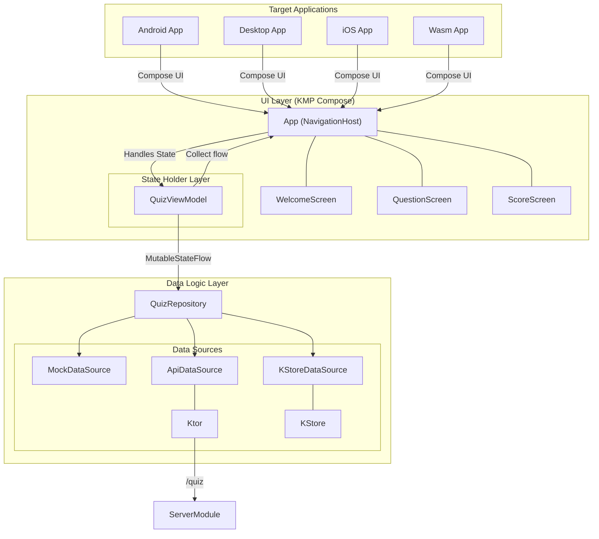

```mermaid
graph TD 

subgraph "Target Applications" 

A[Android App]; 
B[Desktop App]; 
D[iOS App]; 
E[Wasm App]; 

end

A & B & D & E -- Compose UI--> F;

subgraph "UI Layer (KMP Compose)"
    F --- C1[WelcomeScreen]
    F --- C2[QuestionScreen]
    F --- C3[ScoreScreen]
    F["App (NavigationHost)"]
    subgraph "State Holder Layer"
     G[QuizViewModel]
    end
end


subgraph "Data Logic Layer"
    H[QuizRepository]
    subgraph "Data Sources"
      I[MockDataSource]
      J[ApiDataSource]
      K[KStoreDataSource]
      J --- M[Ktor]
      K --- KStore
    end
end

M -- /quiz --> ServerModule
F -- Handles State --> G;
G -- Collect flow --> F;
G -- MutableStateFlow --> H;
H  --> I & J & K;
```
